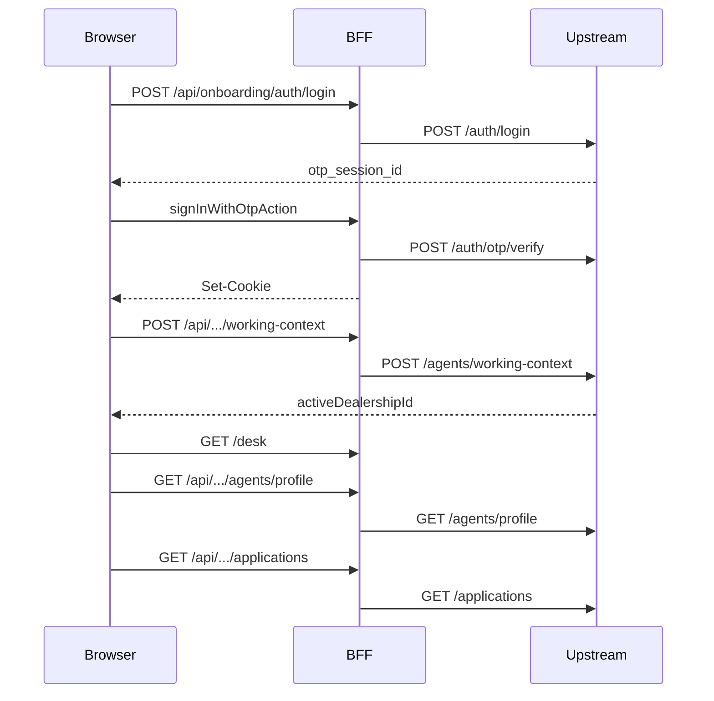

# Dealership locations & working context — future implementation plan

**Status:** Planned (not shipped)  
**Last updated:** 2026-08-03  
**Related:** [`overview.md`](overview.md) · [`api-contract.md`](api-contract.md) · [`implementation-plan.md`](implementation-plan.md)

---

## 1. Problem

Jiwambe operates a **main hub** and **partner dealerships** around Nairobi. Onboarding officers use this tablet PWA at any site. The platform must know:

- **Who** is acting (officer identity)
- **Where** they are working right now (dealership / location context)
- **What** they may see and assign (inventory, worklist, application attribution)

This is **not** multi-tenant SaaS (separate Jiwambe instances per dealer). It is **single-tenant, multi-location**: one platform, many sites, shared ops and LMS.

---

## 2. Current state (shipped demo)

| Area | Today |
|------|--------|
| Officer profile | `GET /onboarding/agents/profile` returns static `dealership` + optional `dealershipId` ([`api-contract.md`](api-contract.md)) |
| Application | `assignment.officerId`, `assignment.dealershipId`, `assignment.dealershipName` on resource |
| Inventory | `GET /inventory?dealershipId=` (optional query hint) |
| Auth.js BFF session | **Tokens only** — profile not stored on JWT |
| UI | Profile sheet shows dealership name; chrome fetches profile on desk/capture |
| Enforcement | Documented: upstream must enforce assignment / dealership (403 on mismatch); client must not be trusted for ids |

**Gap:** No **active working location** per login session. Profile `dealershipId` is a single static field — insufficient for officers who move between hub and partner sites.

---

## 3. Target architecture

### 3.1 Concepts

| Concept | Owner | Description |
|---------|--------|-------------|
| **Officer identity** | Upstream | Who logged in; `allowedDealershipIds[]`; role (`FIELD`, `SUPERVISOR`, …) |
| **Working context** | **Upstream** | `activeDealershipId` for this officer **session** (where they work *now*) |
| **Application assignment** | Upstream | Stamped on create: `officerId` + `dealershipId` from session — **not** from client body |
| **BFF / Auth.js** | This app | Browser cookie + upstream `access_token` / `refresh_token` only |

**Rule:** `activeDealershipId` is authoritative on **upstream** (officer session record or access-token claim issued by upstream). The Next.js BFF forwards the Bearer token; it does **not** become the source of truth for dealership scope.

### 3.2 Location model (upstream)

```text
Location {
  id
  name
  type: HUB | PARTNER_DEALERSHIP
  region          // e.g. Nairobi
  status: active | suspended
}
```

Main office is `type: HUB`, not a separate product surface.

### 3.3 Officer session (upstream)

After OTP verify, upstream creates (or updates) an officer session:

```text
OfficerSession {
  sessionId
  officerId
  activeDealershipId    // null until set, or default home location
  deviceId?             // optional: tablet registered to a site
  expiresAt
}
```

**Pattern A (recommended):** store `activeDealershipId` on session row; access token carries `sessionId`. Changing site updates session — no re-login.

**Pattern B:** embed `active_dealership_id` in access token; `POST working-context` issues new token.

### 3.4 Authorization rules (upstream)

On every protected call:

1. Resolve officer from `Authorization: Bearer`
2. Load `activeDealershipId` from officer session (or token claim)
3. **Creates/writes:** stamp `assignment.dealershipId` from session; reject if `activeDealershipId` unset
4. **Reads:** filter worklist/inventory by session scope; supervisors may query broader scope by role
5. **Never** trust client-supplied `dealershipId` on create — ignore or override

---

## 4. Login → desk — API sequence

### 4.1 Shipped today

| Step | Browser → BFF | BFF → upstream |
|------|----------------|----------------|
| 1 | `GET /` | — |
| 2 | `GET /api/auth/session` | — |
| 3 | `POST /api/onboarding/auth/login` | `POST /onboarding/auth/login` |
| 4 | Server Action `signInWithOtpAction` | `POST /onboarding/auth/otp/verify` (inside Auth.js `authorize` only) |
| 5 | Auth.js sets session cookie | — |
| 6 | `GET /desk` | — |
| 7 | `GET /api/onboarding/agents/profile` | `GET /onboarding/agents/profile` |
| 8 | `GET /api/onboarding/applications` | `GET /onboarding/applications` |

OTP verify has **no** public BFF route — browser never calls upstream directly.

### 4.2 After working context (planned)

Insert after step 5 when officer has multiple allowed locations (or policy requires daily confirm):

| Step | Browser → BFF | BFF → upstream |
|------|----------------|----------------|
| 5b | `POST /api/onboarding/agents/working-context` `{ dealershipId }` | `POST /onboarding/agents/working-context` |
| 5c | Response: `{ activeDealershipId, dealershipName }` | Upstream validates allow-list, updates session |

Then profile and applications use session scope:

- `GET /onboarding/agents/profile` includes `activeDealershipId`, `allowedDealerships[]`
- `POST /onboarding/applications` — upstream stamps `assignment` from session (no `dealershipId` in body)
- `GET /onboarding/applications` — default filter from session; optional `dealershipId` for supervisors only
- `GET /inventory` — default `activeDealershipId` from session



---

## 5. UI / UX (planned)

| Surface | Behaviour |
|---------|-----------|
| Post-login | If `allowedDealerships.length > 1` or policy requires confirm → **“Where are you working today?”** picker |
| Chrome top bar | Persistent **Working at: {name}** chip; tap to switch (warn if open draft) |
| Profile | Home location vs **current session** location |
| Bike stage | Subtitle: stock at active dealership |
| Desk worklist | Default: applications for active location (and role rules) |
| Switch mid-shift | Draft stays tied to **original** `assignment.dealershipId`; block switch or require pause |

**Device registration (optional v2):** tablet bound to `locationId` → default working context without picker; override only for hub supervisors.

---

## 6. API changes (to specify in OpenAPI when implementing)

### New / extended upstream

| Method | Path | Purpose |
|--------|------|---------|
| `POST` | `/onboarding/agents/working-context` | Set `activeDealershipId` on officer session |
| `GET` | `/onboarding/agents/profile` | Add `activeDealershipId`, `allowedDealerships[]` |
| `POST` | `/onboarding/applications` | Server sets `assignment.dealershipId` from session |
| `GET` | `/onboarding/applications` | Default scope from session; supervisor overrides |
| `GET` | `/inventory` | Default `dealershipId` from session |

### BFF mirrors

| BFF | Notes |
|-----|--------|
| `POST /api/onboarding/agents/working-context` | Proxies upstream; requires Auth.js session |
| Extend `GET /api/onboarding/agents/profile` | Pass through new fields |
| `POST /api/onboarding/applications` | Do not accept client `dealershipId` |
| `GET /api/inventory` | Omit query param in client; upstream defaults from session |

### MSW

- Seed multiple locations and officers with different `allowedDealershipIds`
- Profile reflects `activeDealershipId` after working-context POST
- Inventory and applications filter by active context

---

## 7. Implementation phases

### Phase A — Upstream contract (platform team)

- [ ] `Location` entity and admin seeding (hub + partners)
- [ ] Officer `allowedDealershipIds` and roles
- [ ] `OfficerSession.activeDealershipId`
- [ ] `POST /onboarding/agents/working-context`
- [ ] Profile + create/list/inventory scoped from session
- [ ] 403 when `activeDealershipId` unset on writes

### Phase B — BFF (this repo)

- [ ] `POST /api/onboarding/agents/working-context` route + tests
- [ ] Extend profile route/schema for `activeDealershipId`, `allowedDealerships`
- [ ] Remove/stop forwarding client `dealershipId` on application create
- [ ] Inventory BFF: default from profile/session, not client query
- [ ] MSW handlers for multi-location flows

### Phase C — UI (this repo)

- [ ] Working-context picker (post-login or blocking modal before desk)
- [ ] Chrome “Working at” chip + switch flow
- [ ] Desk/inventory/capture copy reflects active site
- [ ] E2E: login → pick site → desk shows scoped worklist

### Phase D — Hardening

- [ ] Device ↔ location registration (optional)
- [ ] Supervisor cross-location worklist
- [ ] Application transfer workflow (if product requires)
- [ ] Audit logs: `officerId` + `dealershipId` on structured logs (align with Phase 12 session logging)
- [ ] **Upstream `X-Request-Id`** — only after platform supports server-side request logging; until then BFF must not forward the header on real upstream ([`implementation-plan.md`](implementation-plan.md#upstream-request-id-deferred))

---

## 8. Open product questions (decide before Phase A)

1. Officers: Jiwambe contractors only, or dealer employees too?
2. Same officer at hub and dealer same day — how often?
3. Commission / reporting: attribute at create, bike assign, or handover?
4. Stock: assign only from active dealership pool?
5. Worklist: own applications only vs all at this dealership?
6. Main office: supervisor view across all Nairobi dealers?
7. Tablets: fixed per site vs officer-carried device?
8. Application `dealershipId` immutable after submit, or transfer allowed?
9. Dealers: franchise partners (Jiwambe sees all) vs isolated commercial entities?

---

## 9. References in codebase

| File | Relevance |
|------|-----------|
| [`docs/api-contract.md`](api-contract.md) | Officer profile, assignment, inventory `dealershipId` |
| [`src/lib/onboarding/application-resource.ts`](../src/lib/onboarding/application-resource.ts) | `ApplicationAssignment` |
| [`src/lib/onboarding/schemas/officer-profile-schemas.ts`](../src/lib/onboarding/schemas/officer-profile-schemas.ts) | Profile shape |
| [`src/components/onboarding/onboarding-chrome-context.tsx`](../src/components/onboarding/onboarding-chrome-context.tsx) | Profile fetch for chrome |
| [`src/mocks/handlers/ecosystem-inventory.ts`](../src/mocks/handlers/ecosystem-inventory.ts) | `dealershipId` query |

---

## 10. Success criteria

- Officer at partner site A cannot assign stock from site B without supervisor override
- New application `assignment.dealershipId` matches upstream session, not UI guess
- Login → (optional site pick) → desk shows correct scoped worklist in E2E
- `api-contract.md` and OpenAPI updated in same PR as BFF/UI changes
