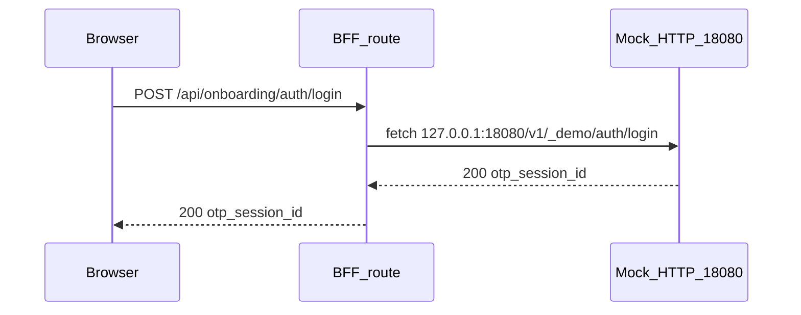

# Local development — MSW mock upstream

This app uses a **BFF** (`/api/*`). The browser never calls `JIWAMBE_API_BASE_URL` directly.

## Environment (`.env.local`)

| Variable | Local demo value | Meaning |
|----------|------------------|---------|
| `MOCK_JIWAMBE_API` | `1` | Start the in-process mock upstream HTTP server |
| `JIWAMBE_API_BASE_URL` | `http://127.0.0.1:18080` | Upstream **host root** — BFF appends `/v1/field/...` paths |
| `NEXTAUTH_SECRET` | (openssl rand -base64 32) | Session signing |
| `NEXTAUTH_URL` | `http://localhost:3000` | App origin |

**`127.0.0.1:18080` is not a real API you must run.** With `MOCK_JIWAMBE_API=1`, [`src/mocks/jiwambe-msw-server.ts`](../src/mocks/jiwambe-msw-server.ts) starts an Express server on that host/port that serves the same handlers as E2E tests.

## Demo credentials (single source of truth)

Defined in [`src/lib/global/auth/demo-credentials.ts`](../src/lib/global/auth/demo-credentials.ts):

| Field | Value |
|-------|-------|
| Email | `john@jiwambe.com` |
| Password | `demo12345` |
| OTP | `123456` |

MSW only accepts **seeded officers** in [`officer-auth-mock-state.ts`](../src/mocks/officer-auth-mock-state.ts). Random emails return `401 invalid_credentials` even if the format is valid.

## Mock state lifecycle

Mock data (applications, deposits, officer passwords, etc.) lives in **Node memory** for the lifetime of the `pnpm dev` process.

| Action | Effect |
|--------|--------|
| Restart `pnpm dev` | Fresh demo password and seed data |
| Profile → change password | `demo12345` stops working until reset |
| `pnpm dev:reset-mocks` | Resets in-memory mock state without restart |
| E2E (`pnpm test:e2e`) | Separate process on port **3100**; auto-resets before each test via `POST /api/onboarding/e2e/reset-mocks` |

E2E **does not** corrupt a parallel `pnpm dev` on port 3000 — different processes.

## Health check

`GET /api/onboarding/health` probes the mock upstream when `MOCK=1`. If `checks.upstream` is `failed`, login and desk APIs will fail.

## Troubleshooting

| Symptom | Cause | Fix |
|---------|-------|-----|
| `ECONNREFUSED 127.0.0.1:18080` on login | Mock HTTP server not running (see RCA below) | Restart `pnpm dev`; verify `MOCK_JIWAMBE_API=1`; check health endpoint |
| `503 mock_upstream_unavailable` | BFF could not reach mock server | Same as above |
| Amber “session expired” banner after clearing cookies | URL still has `?sessionExpired=1` | Open `http://localhost:3000/` without query params (fixed in app: param is stripped after sign-out) |
| `demo12345` rejected after QA | Password changed in mock state | `pnpm dev:reset-mocks` or restart dev server |
| MSW npm registry warnings | Old fetch-intercept approach (removed) | Should not appear after mock HTTP server migration |

## RCA: ECONNREFUSED with `MOCK=1` (2026-07-31)

**What happened:** Login returned `500` / `TypeError: fetch failed` with `ECONNREFUSED 127.0.0.1:18080`.

**Root cause:** MSW was started via `setupServer().listen()`, which **patches global `fetch`**. Next.js 16 **Turbopack** compiles API routes in a separate bundle where that patch does not apply to the `fetch` used by BFF routes. Page SSR sometimes showed MSW warnings (npm registry) while `POST /api/onboarding/auth/login` bypassed the interceptor and hit the real network on port 18080 — nothing listens there by design.

**Fix:** Replaced fetch interception with a **real HTTP mock server** on `JIWAMBE_API_BASE_URL`'s host/port (`@mswjs/http-middleware`). BFF `fetch()` now uses normal TCP to localhost; works in every Turbopack bundle.

**Prevention:** Health check probes mock upstream when `MOCK=1`; integration test in `jiwambe-msw-server.test.ts`; agent rules in `AGENTS.md` and `.cursor/rules/local-dev-msw.mdc`.
