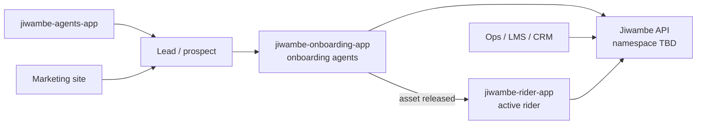

# Jiwambe Onboarding — Application Overview

**Status:** Active — Spec + infra (Phase 0–1)  
**Product name:** Jiwambe Onboarding  
**Repository:** `jiwambe-onboarding-app`  
**Design reference:** [`prototype/`](prototype/) — SSOT for layout and copy  
**Implementation plan:** [`implementation-plan.md`](implementation-plan.md)  
**Implementation status:** [`implementation-status.md`](implementation-status.md)  
**API sketch:** [`onboarding-applications-api-contract.md`](onboarding-applications-api-contract.md) — officer applications (draft); [`field-rider-api-contract.md`](field-rider-api-contract.md) — rider self-serve sketch  
**Last updated:** 2026-07-29

---

## 1. Purpose

Jiwambe Onboarding is a **tablet-first Progressive Web App (PWA)** used by **onboarding agents** at Jiwambe offices and **partner dealerships**. When a rider is **in person** for conversion, agents use this app to run readiness checks, capture KYC and documents, verify deposit, assign stock, submit to operations, and—after approval—execute the **loan agreement** and **bike handover**.

This is the **conversion step** for a lead: the customer may have been referred via **jiwambe-agents-app** or may have progressed from the marketing site. **After the asset is released**, the customer manages the bike and payments in **`jiwambe-rider-app`** — not in this app.

The app is a **thin BFF client**: the browser talks only to Next.js; Next.js calls the Jiwambe API (`JIWAMBE_API_BASE_URL`; path namespace **TBD**). **No loan, quote, deposit minimum, or daily installment calculations** in production UI — values are **display-only** from the backend. (The HTML prototype uses client-side demo math; see [`prototype-gaps.md`](prototype-gaps.md).)

---

## 2. System context

Agents refer prospects; marketing can drive self-serve interest. Onboarding agents complete field capture and handover. Back-office creates the facility in the LMS and returns applications to agents for agreement and release.

**Note:** [`portal-migration.md`](portal-migration.md) describes **customer portal → rider app**, not this product.

---

## 3. Users

| User | Role in this app |
|------|------------------|
| **Onboarding agent** | Logs in (email + password + OTP); runs capture wizard; manages worklist; agreement and release ceremonies |
| **Rider (customer)** | Present in person; provides documents; signs on tablet; confirms handover via **SMS OTP** at release — does **not** use this app for ongoing servicing |

---

## 4. Application lifecycle (agent worklist)

Prototype states (see [`prototype/js/data.js`](prototype/js/data.js)):

| State | Agent-facing meaning | Typical action |
|-------|----------------------|----------------|
| **OPS_REVIEW** | Submitted; awaiting back-office | Wait; no in-app action |
| **LMS_CREATED** | Approved; facility in LMS | Open **agreement** flow — generate/sign |
| **AGREEMENT_SIGNED** | Signed; preparing release | Wait (ops/back-office) |
| **READY_FOR_RELEASE** | Cleared for handover | Open **release** flow — PDI, OTP receipt |
| **ACTIVE_LOAN** | Handover complete | **Summary** (read-only) |
| **PAUSED** | TAT stopped; bike returned to stock | Resume from drafts or re-assign bike |
| **DISQUALIFIED** | Terminal | Summary only |

Internal capture draft (`DRAFT` / in-wizard) is not shown on the public board until submitted.

---

## 5. Authentication and session (Phase 3+)

**UX (v1):** Matches [`prototype/js/auth.js`](prototype/js/auth.js) — **email + password**, then **SMS OTP** on the registered phone.

- Step 1: email and password (minimum 8 characters) → **Continue**
- Step 2: 6-digit verification code → **Verify & sign in**
- Session: Auth.js v5 JWT; upstream tokens **server-side only**
- Token refresh **only** in the Auth.js `jwt` callback
- Post-login landing: **desk / worklist** (`/desk`)
- Sign out: BFF revokes upstream session, clears cookie

**Local demo (MSW):** any valid email and 8+ character password reach the OTP step; code **`123456`** completes sign-in as the seeded officer. Upstream MSW login still uses the demo agent phone internally until the API contract supports email + OTP end-to-end.

---

## 6. Major flows

Map to split prototype entry points ([`prototype/index.html`](prototype/index.html)).

### 6.1 Auth

- Agent login and session establishment
- Reference: [`auth.html`](prototype/auth.html), [`js/auth.js`](prototype/js/auth.js)

### 6.2 Desk

- **Worklist** — board/list by ops stage (agreement, release, review)
- **History** — completed applications
- **Drafts** — paused captures, resumable
- **Notifications** — e.g. application returned from ops
- Reference: [`desk.html`](prototype/desk.html), [`js/desk.js`](prototype/js/desk.js), [`js/desk-app.js`](prototype/js/desk-app.js)

### 6.3 Capture wizard (10 stages)

| # | Stage key | Label |
|---|-----------|--------|
| 1 | `readiness` | Readiness check |
| 2 | `lookup` | Customer lookup |
| 3 | `identity` | Identity and contact |
| 4 | `dl` | Driving licence |
| 5 | `cogc` | Certificate of good conduct |
| 6 | `references` | References (incl. next of kin) |
| 7 | `model` | Operating model |
| 8 | `product` | Product, financing and deposit |
| 9 | `bike` | Bike assignment |
| 10 | `review` | Review and submit |

Reference: [`capture.html`](prototype/capture.html), [`js/capture.js`](prototype/js/capture.js)

**Submit** moves application to **OPS_REVIEW** (online) or **queues offline** until sync.

### 6.4 Post-ops (on desk)

| Flow | When | Reference |
|------|------|-----------|
| **Agreement** | `LMS_CREATED` | Dual signature (customer then agent), scroll-to-end gate — [`js/flows.js`](prototype/js/flows.js) |
| **Release** | `READY_FOR_RELEASE` | Handover checklist, defect pause, customer OTP on registered SIM |
| **Summary** | `ACTIVE_LOAN`, `DISQUALIFIED`, history | Read-only folder view |

### 6.5 Pause and disqualify

- **Pause** — reason required; paused capture saves to drafts; **submitted** pause **releases bike** to stock
- **Disqualify** — terminal; bike released if assigned

---

## 7. Scope boundaries

**In scope (this app):**

- Readiness gate with customer present
- KYC, document capture (camera), reference calls
- Operating-model verification (fleet / stage / delivery / personal)
- Product selection, **server-validated** deposit (STK or M-Pesa confirmation code)
- Bike assignment from **dealership stock** (insurance sticker rules)
- Submit to ops; agreement and release ceremonies in the field

**Out of scope / back-office:**

- LMS account creation (ops triggers; agent sees `LMS_CREATED` when returned)
- Insurance underwriting and sticker issuance at stock receipt (inventory feed is read-only)
- Agreement **before** ops approval (signing happens after LMS creation in prototype)
- Full PDI policy in CRM — release flow captures defect notes and pause only
- Post-activation servicing ( **`jiwambe-rider-app`** )

---

## 8. Business rules

- **Deposit minimums** vary by operating model (Fleet, Stage, Delivery, Personal) — **API enforces**; UI displays only
- **STK push** and **M-Pesa confirmation codes** — validated **only** on the server; UI shows status from BFF
- **Bike hold** — selecting stock starts a soft lock timer in prototype; production rules from API
- **Pause** on submitted apps releases assigned bike to stock; resume requires re-assignment
- **Disqualify** cannot be undone
- **Face match, ID OCR, pre-submit anomaly scan** — simulated in prototype; integrate via API when available
- **English-only v1** — Kiswahili deferred

---

## 9. UX and device

- **Tablet-first** — step rail + wide content (prototype); installable PWA on dealership devices
- **Offline-first** — capture may continue offline; submissions queue and sync ([`TopBar`](prototype/js/chrome.js) connectivity + queue)
- **Dealership context** — stock filtered by agent’s hub; officer profile and station in chrome

---

## 10. Target Next.js routes (normative)

Implemented as shells in Phase 2 (see [`implementation-plan.md`](implementation-plan.md)). Application detail sub-routes: `/desk/applications/[id]`, `.../agreement`, `.../release`, `.../summary`.

| Route | Purpose |
|-------|---------|
| `/` | Agent login (email + password + OTP) |
| `/desk` | Worklist (board / list) |
| `/desk/history` | Completed applications |
| `/desk/drafts` | Paused / draft applications |
| `/capture` | Wizard shell (redirect to first stage) |
| `/capture/[stage]` | Capture stage (`readiness` … `review`) |
| `/offline` | No connection |
| `/account-blocked` | Agent account disabled |

**BFF:** `/api/onboarding/*` keys in [`routes.ts`](../src/lib/global/shared/routes.ts); officer applications per [`onboarding-applications-api-contract.md`](onboarding-applications-api-contract.md).

---

## 11. Related products

| Product | Role |
|---------|------|
| **jiwambe-agents-app** | Field agents refer leads; separate app |
| **jiwambe-rider-app** | Rider self-service **after** handover (pay, bike, cover, service) |
| **jiwambe-customer-portal** | Legacy portal — migration target is **rider app**, not onboarding app |

---

## 12. Out of scope (this app)

- Rider self-service apply/track (rider app / marketing funnel before visit)
- Agent referral commissions (agents app)
- Full back-office ops console
- Inventory management (read-only assignment only)
